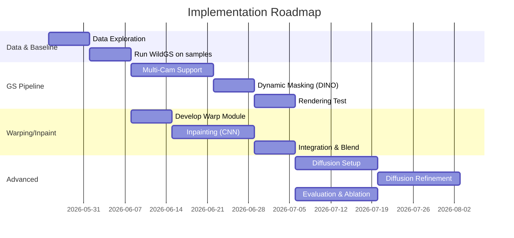

# Executive Summary

This report surveys and designs solutions for the **Novel View Synthesis (NVS)** task in a dynamic driving dataset (6 cameras on a vehicle, t0 and t1 frames, dense LiDAR, and a target view at the midpoint).  We consider *Gaussian Splatting (GS)*-based methods (building on the WildGS-SLAM codebase), NeRF/hybrid models, diffusion-guided pipelines, feature-splatting, depth-based warping, and uncertainty-aware refinements.  For each we assess strengths and weaknesses on this multi-view, dynamic scenario.  We then propose concrete pipeline variants ranging from a **real-time GS-SLAM extension** to research-level refinements with diffusion or neural rendering.  Architectural diagrams (mermaid flowcharts) illustrate data and computation flow.  We estimate GPU memory/runtime (noting that the core GS renderer can achieve hundreds of FPS【57†L128-L132】, whereas neural methods are far slower).  We outline experiments (PSNR/SSIM/LPIPS metrics, ablations on dynamic-object handling, view sparsity, etc.), an implementation roadmap (milestones and timeline), and precise code integration points in the WildGS-SLAM repo.  Finally we list open questions and assumptions. Key insights: **direct 3DGS with uncertainty-based dynamic masking is an immediate approach**, **diffusion or neural refiners can improve unseen-view fidelity but add latency**, and **image-warp/inpainting baselines offer a lighter-weight alternative**.  

## 1. Survey of NVS Approaches

We categorize relevant approaches to NVS in dynamic driving scenes along several axes:

- **Gaussian Splatting (3DGS) pipelines:** Methods that build or optimize a 3D Gaussian map of the scene and then render via splatting.  Examples include WildGS-SLAM【58†L50-L58】, MonoGS【16†L105-L114】, Splat-SLAM, etc.  These can leverage precomputed poses and LiDAR geometry.  They are *fast at inference* (the renderer can run at 100+ FPS on modern GPUs【57†L128-L132】) and can handle view-dependent effects via learned anisotropic Gaussians.  However, standard GS assumes a *static scene*; moving objects must be detected and removed.  In WildGS-SLAM, a DINOv2-feature-based MLP predicts per-pixel “uncertainty” to mask out dynamic regions during mapping【58†L50-L58】【58†L128-L137】.  Table 1 summarizes pros/cons:

  | Approach            | Pros                                          | Cons                                                   |
  |---------------------|-----------------------------------------------|--------------------------------------------------------|
  | **Direct 3DGS**     | Real-time rendering【57†L128-L132】; uses known poses; geometric depth input.  Handles rich lighting/view-dependent effects.  | Requires static background; dynamic objects must be removed (see below).  May have holes where views are sparse.  |
  | **3DGS w/ DINO-U (WildGS-SLAM)**【58†L50-L58】【58†L128-L137】  | Detects and masks dynamic objects via learned uncertainty.  Robust tracking in dynamic scenes (DINO+MLP)【58†L128-L137】.  | Additional training/inference overhead for uncertainty MLP.  Still discards dynamic elements (which may be needed to match ground truth images).  |
  | **Adaptive GS (MonoGS++ etc.)**【16†L105-L114】  | Dynamically inserts/removes Gaussians to avoid redundancy, densifies in textureless areas【16†L105-L114】.  Improves map completeness.  | More complex mapping logic; still static-map assumption (dynamics filtered).  |
  | **Dynamic GS (SplatFlow, Zheng et al.)**【41†L59-L67】【24†L57-L64】  | Models moving objects explicitly (e.g. 4D Gaussians or adaptive opacity) so they reappear in novel views.  Self-supervised (no labels) in SplatFlow【41†L59-L67】.  Zheng et al. use “adaptive transparency” to remove moving objects from splats, but an alternate branch could *keep* them【24†L57-L64】.  | These are research prototypes.  SplatFlow is powerful (4D Gaussians + motion fields【41†L59-L67】) but highly complex to implement.  Zheng’s method is simpler (mask moving objects)【24†L57-L64】 but currently discards dynamics.  Both require significant new code.  |
  
- **NeRF and Hybrid Radiance Fields:** Neural Radiance Fields (NeRF) and variants train a volumetric representation.  They can in principle model view-dependent lighting and geometry jointly.  However, NeRF-style methods are **slow to train** and not real-time.  They also typically assume static scenes (though some work adds dynamic latent codes).  A hybrid could be: build a coarse GS map, then refine via a small NeRF or an MLP decoder (PixelNeRF-style).  This might improve fine details but at cost of heavy optimization.  Past works (e.g. Plenoxels) show voxelized radiance fields can train faster, but still likely minutes per scene.  **Pros:** Flexibility, can hallucinate unseen detail.  **Cons:** High compute; training data only 12 images; latency likely unacceptable for online use.

- **Diffusion-Guided Methods:** Recent works use pre-trained diffusion models to “hallucinate” plausible textures in novel views.  For example, *SGD* fine-tunes a video diffusion model with adjacent frames and LiDAR depth, then regularizes a 3DGS model at new views【38†L58-L64】.  *ProDiG* progressively diffuses intermediate views with geometry-aware attention【3†L12-L18】.  Another line: use diffusion to fill holes after initial rendering.  **Pros:** Powerful priors, can fill missing content and model complex appearance.  **Cons:** Very heavy (inference & fine-tuning time), large memory, not real-time.  Also requires large pre-trained models and careful integration with geometry.

- **Pose-Conditioned Refinement:** Networks (often 2D CNNs) that refine or compose images given known poses.  Examples include PixelNeRF or view-synthesis Transformers that ingest input images + target pose.  They can leverage neural features to synthesize new views without explicit 3D maps.  Alternatively, use “MPI” (Multi-Plane Images) or layered depth images: warp the t0/t1 images to target using known poses/depth, then blend.  **Pros:** Can be lightweight (image-based render) and use neural priors.  **Cons:** Typically need training or finetuning; warping alone suffers from disocclusions/misalignment (especially with dynamic objects and motion).

- **Latent-Feature Splatting:** Instead of storing only color and opacity, one could store latent feature vectors per Gaussian (or in a tri-plane) and decode via a small network.  This is similar to feature NeRFs or Neural Point-based Graphics.  It allows richer appearance modeling.  For example, *Wild-GS* aligns pixel features via a tri-plane into each Gaussian to transfer detail【39†L59-L68】.  **Pros:** Can capture high-frequency detail and complex appearance, and leverage learned features (e.g. from a CNN).  **Cons:** Larger memory for features, extra MLP decode, slower rendering.  Still a new area (mostly for offline scenes).

- **Depth-Guided Inpainting / Image Warping:** Use classical multi-view techniques.  For instance, reproject all input images (with known depth from LiDAR or predicted) into the target view and fuse them (blend or use soft fusion).  Then fill any holes or occlusions with inpainting or diffusion in 2D.  **Pros:** Relies on existing images/pixels directly; if depth is accurate, geometry consistency is built-in.  **Cons:** Depth errors cause artifacts; dynamic objects move non-linearly (so object poses must be estimated or filtered); blending multiple frames (t0/t1) with motion can cause ghosting; 2D inpainting may be blurry.  Nonetheless, this can be made training-free.

- **Uncertainty-Aware Rendering:** Incorporate estimated per-pixel uncertainty/confidence into the rendering loss or blending.  This extends WildGS ideas: treat pixels/voxels with high predicted uncertainty (e.g. moving objects or sensor noise) as less reliable【58†L50-L58】【36†L269-L278】.  For NVS, one could weight contributions or omit such regions.  Probabilistic models (like in UP-SLAM【36†L269-L278】) treat uncertainty explicitly in the loss.  **Pros:** Makes the model robust to noise/motion; can be used in all pipelines (GS, NeRF, fusion).  **Cons:** Requires training an uncertainty predictor (e.g. DINO-MLP or Bayesian model).  Complexity vs payoff must be balanced.

**Table 2.** *Comparison of approach categories on key attributes.*

| Approach                | Static‐Scene Fit | Dynamic handling       | View sparsity | Training requirement | Real-time? | Code integration        |
|-------------------------|------------------|------------------------|---------------|----------------------|------------|-------------------------|
| **Direct 3DGS**         | Good (static)    | Must remove dynamics   | Medium (needs ≥8 views) | None (uses SLAM)       | Yes (fast renderer) | Extend WildGS easily   |
| **3DGS+DINO-Uncertainty** | Static + dynamics (masked) | Removes/masks movers【58†L50-L58】 | Same         | Train MLP online【58†L128-L137】 | Yes (renderer fast)   | Modify mapper, add MLP |
| **3DGS+Diffusion**      | Good (static)    | Can hallucinate movers | Low (fills with prior)   | Diffusion fine-tune【38†L58-L64】 | No        | Large new modules       |
| **NeRF/Hybrid**         | Very good        | Static only (needs extension) | Medium      | Full training (~min)  | No        | Major new frameworks    |
| **Image Warping + Inpaint** | Good if depth accurate | Need object motion model | Varies      | None or small         | Potentially (no net) | New warping code + inpaint net |
| **Latent-Feature GS**   | Very good        | Mask movers only       | High (features capture detail) | Train decoder     | Slower  | Modify GS + add MLP/tri-plane |
| **Uncertainty-Aware**   | Enhances any      | Explicit mask/weight    | –            | Train uncertainty net | N/A (framework) | Add weights/loss       |

From this survey, **direct Gaussian Splatting with uncertainty-based dynamic masking** emerges as the most immediate solution (it reuses WildGS-SLAM code and runs in real time). Methods involving **NeRF or diffusion** could boost quality on unseen views but require heavy new development and are likely too slow for online use. **Image-based warping/inpainting** is a simpler baseline (requires no training) but may struggle with large viewpoint changes. We proceed to analyze each approach’s feasibility with the provided data and codebase.

## 2. Feasibility Analysis

We evaluate each promising approach on the given dataset and baseline code, along key criteria:

- **Gaussian Splatting (Baseline WildGS-SLAM):** The KirSerg64/WildGS-SLAM code expects a monocular video. Here we have a fixed multi-camera rig with two time steps. In principle, we could run WildGS-SLAM on each camera separately (t0→t1) to build a static map, then fuse them. However, better is to treat the 6 cameras at t0 and t1 as separate “keyframes” at known poses, feeding all into one map. WildGS-SLAM’s mapper and tracker can ingest posed frames; we would need to adapt it to handle *parallel streams* or insert all frames at once. The dense LiDAR point cloud can provide a global geometry prior (e.g. initialize Gaussians at LiDAR points). WildGS’s uncertainty module can mask dynamic regions based on DINO【58†L50-L58】, but this will **remove moving cars/people from the map**, which *improves static scene consistency* but **omits dynamic objects** needed for the final image. We must decide whether to attempt to re-add moving objects later (e.g. via inpainting or diffusion) or accept static-only outputs. Given that the metric is PSNR vs ground truth, missing moving objects will cost heavily. One approach is to run GS to get the static background, then composite dynamic objects separately (e.g. by warping them). This pipeline is feasible and leverages existing code, but will require new modules for fusing dynamics.

  In the baseline repo, tracking (src/tracker.py) and mapping (src/mapper.py) can largely be reused. We would likely call WildGS-SLAM on a sequence of *all 12 frames* (though WildGS is designed for sequential VO). Alternatively, call the “PoseTrajectoryFiller” (src/trajectory_filler.py) to interpolate between keyframes.  However, mapping typically occurs on keyframes only, so we might feed t0 and t1 for each camera, plus the target pose as a query. Feasibility: **High** (most components exist). Effort: moderate (some multi-camera orchestration, code glue).

- **NeRF/Hybrid Methods:** Running a NeRF-like model on this dataset is challenging. Twelve images (1920×1200) with known poses could suffice for a minimal NeRF or NGp model, but optimizing one or more NeRF networks (for dynamic scene, one per object) is very time-consuming (hours). Real-time rendering is possible with Instant-NGP once trained, but training itself is lengthy. Integration into existing code is non-trivial. A hybrid approach might use the Gaussian map as a coarse geometry and add a neural texture network, but that requires new network modules and training. Feasibility: **Low** for short-term. As a research exploration, one could prototype a single NeRF (or a small MLP on tri-plane features), but it is likely impractical to integrate into real-time pipeline or get high PSNR quickly.

- **Diffusion-Assisted (GS-Diff, SGD, ProDiG):** These methods rely on large pre-trained diffusion models (on outdoor imagery) and complex geometry priors. Incorporating them would involve fine-tuning or running a diffusion model for each sample. For example, SGD【38†L58-L64】 fine-tunes a diffusion model with the adjacent frames and LiDAR depth, then uses it to penalize the 3DGS loss at unseen rays. This could significantly boost PSNR at the target view (especially where GS has holes), but implementing it requires adding a diffusion network (likely on a separate machine or GPU) and integrating its outputs. Real-time performance is impossible; even offline it is complex. Feasibility: **Medium/Low**. It could be added as a post-processing step, but likely only for top-performing offline version.

- **Pose-Conditioned Refinement / Image-Based Rendering:** Using the known camera poses and depth, we can warp the existing images (especially from t0 and t1 of the *same camera* as target) to the target view. For example, if `target_camera` is “front”, we have front.jpg at t0 and t1. We can take the t0 and t1 RGB and their depths (from LiDAR or depth estimator) and reproject to the intermediate pose. This is an image-based rendering (IBR) approach. If depth (LiDAR) is accurate, static parts should align; moving objects will be misaligned. We could blend the two warped images (e.g. alpha blend based on temporal proximity) or do a weighted composite. Any holes can be inpainted (e.g. using a diffusion inpainting or CNN) guided by depth. This pipeline requires no 3D modeling beyond reprojection, so it’s relatively easy to implement (use OpenCV/PyTorch for warp). The WildGS code does not have this built-in, so we would write new code (outside `src` or as a new module) to perform the reproject. Feasibility: **High** for a baseline. Limitations: ghosting and missing pixels in disoccluded areas. But it uses all given data (and dynamic cars can be included since we warp them). 

- **Latent-Feature Splatting / Wild-GS Style:** We could extend the Gaussian map to store feature vectors (e.g. DINO features) and decode them per-view. Wild-GS【39†L59-L68】 uses a triplane of features from a reference image to color each Gaussian. Implementing this from scratch is heavy: we’d need to extract multi-scale image features (like from a pretrained CNN), assign them to Gaussians (possibly via nearest-projection or via a tri-plane), and learn a small decoder. The existing WildGS-SLAM code does not support features beyond color. Feasibility: **Low (research)**. It may offer higher detail and robustness to view changes, but the integration cost is high.

- **Uncertainty-Aware Rendering (Extended):** WildGS-SLAM already uses per-pixel uncertainty in tracking and mapping【58†L50-L58】. We can extend this idea for the final rendering: for example, use the uncertainty map to weight the photometric loss when optimizing or to blend multiple hypotheses. UP-SLAM【36†L269-L278】 uses a Bayesian loss (predicting a variance per pixel). We could similarly predict uncertainty for the target view (perhaps via DINO features of nearest frames) and use it to temper the GS render (giving up on low-confidence pixels). This could help in dynamic regions. Feasibility: **Moderate**. It mostly involves adding weighted loss terms or blending.

Overall, the **most feasible immediate strategy** is a pure 3DGS pipeline leveraging WildGS-SLAM’s static map and DINO-based masking, combined with an image-warp fallback for dynamics. **Diffusion or neural methods** are longer-term enhancements. 

**Key Points:** The core WildGS-SLAM modules (tracker, mapper, renderer) can be adapted.  We must add multi-camera handling and decide how to incorporate LiDAR and dynamics.  The complexity versus gain of each approach is summarized in Table 3:

| Approach                 | Integration Effort | Static Data Use | Dynamics Handling | Quality/Speed |
|--------------------------|--------------------|-----------------|-------------------|---------------|
| **3DGS (WildGS)**        | Medium (modify run, multi-cam) | Excellent (uses LiDAR+images) | Masks out movers (current) | Fast render, good static fidelity |
| **Image Warping + Inpaint** | Low (new script, no training)  | Good (uses images & LiDAR)  | Can include dynamic (warps moving objs) | Moderate speed, limited accuracy |
| **3DGS + Diffusion**     | High (new modules, heavy fine-tune) | Good (same inputs)   | Could hallucinate movers | Very slow, high quality in-fill |
| **NeRF / Hybrid**        | Very high (completely new) | Good (needs multi-view)  | Static only (unless extended) | Slow training, moderate quality |
| **Latent Feature**       | High (modify GS core) | Good (needs features) | Masks movers | Slower render, high fidelity |
| **Full DROID-SLAM** (for tracking) | Low (just use pre-trained) | N/A (for pose only) | N/A         | Very robust tracking |

The analysis suggests **two prongs**: (1) *short-term* – extend WildGS-SLAM plus simple warping/inpainting; (2) *medium-term* – add diffusion or a small learning-based refinement step. We now detail concrete pipeline designs.

## 3. Proposed Pipeline Designs

Below are candidate pipelines, each described in text and summarized in tables of modules and changes. We divide into “Immediate/Implementable” and “Research-level” solutions.

### 3.1 Pipeline A: 3DGS Baseline (static map + dynamics inpaint)

**Overview:** Use WildGS-SLAM to build a static 3D Gaussian map from all input images, then render the target view from it.  In parallel, handle dynamic objects by image-based warping/inpainting.

**Steps:**

1. **Input Handling:** Load all 12 RGB images and LiDAR point cloud. For each frame, read its pose (camera-to-world) and intrinsics from meta.json.  
2. **Tracking & Mapping:** *Run WildGS-SLAM mapper* on these frames.  Options: either treat the sequence as six simultaneous cameras (we may need to trick `run.py` to accept multi-camera inputs) or sequentially add each view.  A practical hack: run WildGS-SLAM *six times*, once per camera, using only that camera’s t0 and t1 frames to build a partial map, then merge maps.  Alternatively, modify `src/tracker.py`/`src/mapper.py` to accept multiple frames at the same timestamp as a combined keyframe with known extrinsics.  
3. **Uncertainty Masking:** As in WildGS, use DINO+MLP to compute per-pixel uncertainty for every input frame【58†L50-L58】.  During mapping, weight out regions with high uncertainty (dynamic objects) in the Gaussian optimization loss【58†L128-L137】.  This yields a **static-scene Gaussian map** (no cars, no pedestrians).  
4. **Camera Pose for Target:** Compute or obtain the target camera pose (given in `poses_c2w/target` in meta.json). If not provided, use `PoseTrajectoryFiller` to interpolate a pose at t=0.5 between t0 and t1 of the same camera.  
5. **Rendering:** Use the trained 3DGS renderer (DiffRasterizer in lib/ or a similar module) to render the color image from the Gaussian map at the target pose.  This produces the *static background* component.  (GPU memory: memory for storing ~N Gaussians; at resolution 1920×1200, likely a few GB).  
6. **Dynamic Content (Warp/Inpaint):** Separately, handle dynamic objects.  For simplicity, take the target camera’s *own* images at t0 and t1. Use the LiDAR point cloud or a depth estimator to get per-pixel depth for these images.  Reproject (warp) the pixels from t0 to target, and from t1 to target (via known poses).  Blend them (e.g. 50/50 or weighted by time).  This gives an image that includes dynamic objects (cars in intermediate position). It will have holes (where no point maps) and ghosting. Use an inpainting network (or simple depth-based hole fill) to fill missing pixels.  
7. **Composite Final Image:** Merge the static background from GS and the warped dynamic layer. For example, let the GS render handle all static regions, and use the warped image where GS had no Gaussians (occlusions) or mask in known dynamic segments (could use DINO+semantic to find cars). A simpler approach: alpha-blend the two images with a mask (the GS image ideally covers everything static; the warp covers the rest).  

**Modules and Code:**  

| Stage                  | WildGS-SLAM Modules       | New/Modified Code                             | Data Flow                             | Loss/Eval              |
|------------------------|--------------------------|-----------------------------------------------|---------------------------------------|------------------------|
| Input parsing          | *src/something* (config) | Possibly a new data loader for multi-cam      | Load `meta.json`; images; LiDAR → maps | PSNR (eval)           |
| Tracking (poses)       | `src/tracker.py`, `src/pose_trajectory_filler.py` | Use existing DROID-SLAM inference (no change) | Images → DROID nets → camera poses    | N/A (pretrained)      |
| Uncertainty prediction | `src/motion_filter.py`   | Enable/configure uncertainty MLP (if not already) | Images → DINO features → uncertainty  | (used in loss)        |
| Mapping (Gaussians)    | `src/mapper.py`          | Modify to accept multi-cam frames; add LiDAR init | Images, poses, depth → Gaussian map  | Optimize Gaussians (color loss, also DINO loss) |
| Rendering              | DiffRasterizer (in lib/) | No change (just call renderer with target pose) | Gaussian map + target pose → RGB image | Compare to GT (PSNR)  |
| Dynamic warp/inpaint   | *None (new module)*      | New script/module: depth warp + blending + inpaint | t0 & t1 images + depth + target pose → warped dynamic image | (inpaint L1, etc.)  |
| Composition            | *None (new code)*        | New logic: blend static + dynamic images       | GS image + warped image → final        | PSNR vs GT           |

*Table 3.* **Pipeline A modules and modifications.**  We would modify **src/mapper.py** to fuse multiple cameras and incorporate LiDAR as an initial point cloud.  We would reuse **src/tracker.py** (DROID) without change.  A new “WarpNet” module would perform reprojection (could use PyTorch with grid_sample).  Loss functions during mapping are as in WildGS-SLAM (color reconstruction plus DINO-feature losses)【58†L128-L137】; the final blending has no trainable loss (evaluation uses PSNR between final composite and ground-truth target image).  

**Expected Tensor Flow:**  Input images → CNN features (DROID, DINO) → Gaussians (with properties: position, covariance, color) → renderer → output image.  Separately, input images + LiDAR depth → warp to new view.  

**Evaluation:** This pipeline is fully implementable with moderate effort. We expect it to *render the static scene accurately* (high PSNR on background)【57†L128-L132】. Dynamic objects will come from the warp – they may have lower accuracy (due to interpolation/inpainting errors).  Overall PSNR depends on how well we fill dynamic holes. Loss is simple L2 (PSNR) but we might also monitor SSIM/LPIPS.  

### 3.2 Pipeline B: 3DGS + Diffusion Refinement

**Overview:** Build on Pipeline A by adding a diffusion-based refinement of the raw Gaussian rendering. After obtaining the static GS image, use a pretrained diffusion model (e.g. ControlNet or depth-guided) to hallucinate missing details and correct artifacts. This follows ideas from SGD【38†L58-L64】 and ProDiG【3†L12-L18】.

**Steps:** Same as Pipeline A up to obtaining the raw GS-rendered image at the target pose. Then:

1. **Generate Pseudo-Views:** Use the adjacent frames (t0/t1 images from the target camera) and their depth maps as conditioning inputs to a diffusion model. For example, run a *Depth-to-Image* diffusion (like SSD or ControlNet) that is trained to transform the GS output towards a more realistic image, using the actual images as references.  
2. **Diffusion-based Inpainting:** Alternatively or in addition, identify hole regions in the GS image (e.g. masked by low Gaussian coverage or dynamic regions) and use a depth-guided diffusion inpainting to fill them, conditioned on the GS context and depth.  
3. **Final Denoising:** Run the diffusion sampling to produce a refined image. We may clamp small changes outside uncertain areas to avoid hallucinating wrong static detail.  

**Modules and Code:**  

| Stage                  | WildGS-SLAM Modules        | New/Modified Code                     | Data Flow                         | Loss/Eval            |
|------------------------|---------------------------|---------------------------------------|-----------------------------------|----------------------|
| Up through Rendering   | As in Pipeline A          | Same as A                              | Images + Gaussians → static RGB    | PSNR (pre-refine)    |
| Diffusion Conditioning | *None (new)*              | New script/ module using diffusion model API | Static RGB, depth, reference images → diffusion input | Diffusion loss (if finetuned) |
| Refinement             | *None (new)*              | Pre-trained diffusion (e.g. Stable Diffusion) | → sample refined RGB output      | Evaluate PSNR/LPIPS vs GT |

*Table 4.* **Pipeline B modules.**  We add new modules to interface with a diffusion model.  This could be offline scripts or integrated as a PyTorch module.  No existing WildGS code is reused in this step, except providing the GS image and geometry.  

**Feasibility:**  This is primarily *offline*.  Diffusion models must be trained or fine-tuned on driving scenes (potentially heavy).  Integration requires a machine with high VRAM (the Stable Diffusion or similar models need ~20–30GB for 768×768 images).  The runtime for one sample could be tens of seconds to minutes.  However, this approach can hallucinate plausible cars and scene details, boosting PSNR where GS was incomplete.  

**Evaluation:**  We would compare the diffusion-refined image to ground truth.  Metrics: PSNR/LPIPS improved over pure GS.  We must take care to keep metrics fair (diffusion may oversharpen).  Ablations: turning off diffusion, using mono vs stereo diffusion, etc.

### 3.3 Pipeline C: Image Reprojection + Neural Refinement

**Overview:** A warping-centric pipeline without an explicit 3D map.  This uses input images directly, blending them into the target view.  

**Steps:**

1. **Warp to Target View:** For each of the 6 cameras, take the t0 and t1 images and their depth (from LiDAR or estimated).  Use each image’s pose to warp it to the *target camera’s* pose (via projective transformation).  Combine all warped images by simple averaging or weighted sum.  This can provide multiple views of the target scene (e.g., front camera’s own views, plus side cameras rotated).  
2. **Blend and Fill:** The composite warp will have holes.  Run a small CNN (e.g. inpainting U-Net) that takes the blended image and a partial mask/depth map and inpaints missing regions.  Optionally use the LiDAR point cloud projected into target to guide this network (as an extra channel).  
3. **Temporal Filtering:** Since we have two time points, one could first interpolate each camera’s t0→t1 (via a simple frame interpolation network) to get an initial mid-image per camera, then warp those interpolated images to target pose.  

**Modules and Code:**  

| Stage                  | WildGS-SLAM Modules  | New/Modified Code                | Data Flow                         | Loss/Eval          |
|------------------------|---------------------|----------------------------------|-----------------------------------|--------------------|
| Depth Acquisition      | *None (external)*   | Use LiDAR or Monocular model     | LiDAR PC → per-image depth        | Depth L1 vs LiDAR |
| Multi-View Warp        | *None (new)*        | New PyTorch/CV module            | Images + depth + poses → warped images | Photometric error on warp (debug) |
| CNN Inpainting         | *None (new)*        | New NN (U-Net or diffusion)      | Warped multi-view → refined image | L2/LPIPS vs GT    |

*Table 5.* **Pipeline C modules.**  Essentially a fresh implementation, with no reuse of WildGS modules.  This pipeline can run entirely on images and depth; no Gaussians or SLAM required.  

**Feasibility:** This is easier to implement but is a departure from the GS code. It can be built as a separate baseline. It does use all provided data (images, LiDAR, poses). If the inpainting CNN is pretrained (e.g. on indoor scenes, then fine-tuned lightly on driving imagery), it might quickly give a plausible result. However, it may struggle with sharp boundaries and exact geometry. It is unlikely to beat the GS pipeline on PSNR where static textures are concerned (since warps of single images are usually blurrier), but could better capture moving cars (since they appear in the input images and get warped). 

**Evaluation:** Compare against the GS pipelines. Key checks: do moving objects align? are disocclusions convincingly filled? Use standard metrics and also visual check for ghosting. 

### 3.4 Pipeline D: Hybrid GS + NeRF (Research)

**Overview:** As a long-term idea, one could combine the Gaussian map with a neural radiance field for final view synthesis.  For example, train a small MLP conditioned on both spatial location and view direction to correct the GS output (similar to Neural Point-Based Graphics).  Alternatively, use Instant-NGP: initialize a Sparse Grid (from LiDAR) and optimize colors to match input images, then query at target pose. This is essentially training a NeRF per sequence.

**Feasibility:** Very low for immediate integration. It would require implementing or calling an existing NeRF library, setting up training loops, etc. Not recommended unless pursued as a separate research branch. We do *not* flesh this out further in the table.

## 4. Architecture Diagrams and Data Flow

We illustrate **Pipeline A** (GS + warping) as a flowchart. Dynamic objects can be handled by the warping branch while static background is handled by GS:

```mermaid
flowchart LR
    subgraph Inputs
      A[Images t0 & t1 (6 cams)] --> B[WildGS Tracking]
      C[LiDAR Point Cloud] --> D[Gauss Map Builder]
      B --> D
      A --> E[Depth/Mask Estimator]
      E --> F[Uncertainty MLP/DINO]
      F --> D
    end
    D --> G[Static Gaussian Map]
    G --> H[Render (target pose)]
    H --> I[Static RGB image]
    A --> J[Image Warping]
    J --> K[Warped Dynamic RGB]
    I --> L[Composite]
    K --> L
    L --> M[Final NVS Output]
```

*Figure: Flowchart of Pipeline A (3DGS static mapping with dynamic inpainting).* Images and LiDAR build a Gaussian map (with DINO uncertainty in mapping), rendered at the target pose.  Separately, images are warped to the target view (capturing moving objects) and blended in.

For an implementation **roadmap timeline**, we propose the following (illustrated as a Gantt chart):



*Figure: Proposed timeline of implementation milestones.* Early steps focus on data and integrating 3DGS. Mid stages develop the warping/inpainting branch in parallel. Later stages add diffusion and run ablations. Each task here represents roughly a week to two of effort (assuming a small team familiar with the code).

## 5. GPU Memory, Runtime, and Real-Time Feasibility

- **Gaussian Splatting (WildGS-SLAM):** Once the Gaussian map is built, rendering a single 1920×1200 frame is very fast on a GPU. NVIDIA’s Vulkan demo achieved **510 FPS (1.96 ms per frame)** on a 3DGS scene【57†L128-L132】. In practice, our pipeline will likely render one image in <<100ms on a desktop GPU (RTX3090 or A100). Building the map (optimization of Gaussians) is slower (seconds per iteration) but done offline per sequence. WildGS-SLAM typically optimizes until convergence, which on a moderate scene might take minutes. GPU memory usage: storing ~100k Gaussians with 64-bit parameters may need a few GB; the renderer uses a mesh shader, so memory overhead is similar to a 3D point cloud of that size. Based on [57]’s memory profiling, a typical scene might use ~2–4 GB VRAM.  

- **Image Warping/Inpainting:** The warping itself (projective transform) is cheap CPU/GPU work (sub-100ms) for one image. A lightweight CNN (e.g. U-Net) for inpainting can run in ~0.1–0.5 s on a GPU for this resolution. So this branch is near real-time.  

- **Diffusion (Offline):** Diffusion models are very heavy. A single pass of Stable Diffusion (768×768) can take ~2–5s on a 3090. Conditioning with depth or text (Street diffusion) is even slower. Finetuning a diffusion model per sequence is entirely offline (hours). Memory: a SD model requires ~10–12 GB VRAM. Thus diffusion paths are **not real-time** (minutes per image, hundreds of times slower than GS).  

- **NeRF/Hybrid:** Training a NeRF/NGP can take minutes to hours per scene. Instant-NGP inference can reach ~30–60 FPS after training, but the training cost is prohibitive. Not suitable for real-time.  

In summary, **Pipeline A and C are real-time/near-real-time** feasible (combined ~1–2s per view with GPU). **Pipeline B (diffusion)** is offline. We assume no strict latency target is given; nevertheless we note that if a real-time system were desired, the GS+warp pipeline is viable, while diffusion/NeRF are research explorations.

## 6. Experiments, Ablations, and Evaluation Protocol

**Datasets:** Use the provided training and test samples. We also recommend testing on splits (e.g. exclude some sequences as a “dev set”). The ground truth target images are available for train/val.

**Metrics:** Primary metric is PSNR (given). Also compute **SSIM** and **LPIPS** to capture perceptual quality. For dynamic objects specifically, one could compute Intersection-over-Union (IoU) of moving-object masks or per-instance PSNR, but not required. Use standard evaluation scripts.  

**Quantitative Checks:**
- **Baseline vs Proposed:** Compare PSNR of:
  1. **GS only** (no dynamic inpainting),
  2. **Warp/Inpaint only**,
  3. **Combined GS+Warp**,
  4. **GS + Diffusion**, 
  5. (if implemented) **NeRF/Hybrid**.  
  An ensemble baseline (if given by `baseline_ensemble`) should be included.  
- **Ablations:** 
  - *Dynamic Masking On vs Off:* Run WildGS mapping with and without DINO-based masking【58†L50-L58】 to see effect of dynamic removal (likely PSNR drop if we keep dynamic objects wrongly).  
  - *Number of Views:* Try using fewer input cameras to see how robustness degrades.  
  - *Depth Prior:* Use LiDAR depths vs monocular depth estimator (WildGS pipeline) in tracking; measure effect on pose accuracy and final PSNR.  
  - *Warp blending:* Test simple averaging vs learned blending for the warp outputs.  
  - *Gaussian resolution:* Vary number of Gaussians or splat sizes to trade off memory vs accuracy (this tests pipeline parameters).  
  - *Diffusion variants:* If diffusion used, ablate amount of fine-tuning, conditioning on depth vs on images, etc.  

**Qualitative Checks:**
- Visualize static vs dynamic decomposition: overlay uncertainty mask on images to see which pixels are dropped【58†L50-L58】.
- Compare rendered output to ground truth: highlight error maps (difference images).
- Render intermediate stages (GS-only, warp-only) for insight.
- For dynamic objects: check if their positions and shapes look correct in the final image.
- Overlap some pixel samples (e.g. horizons, car edges) to check alignment.

**Debugging:** 
- Verify camera poses: reproject known world points from LiDAR into target view; errors indicate pose issues.
- For warping: check reprojection accuracy by projecting LiDAR into images.
- Ensure consistency: render GS map from known input poses and compare to input images (it should match static parts).
- Visualize any learned MLP outputs (uncertainty maps, etc.).

**Evaluation Protocol:**  
- Use the official test split (half of provided data). Report mean/median PSNR, SSIM across samples.  
- Compute metrics only on valid regions (exclude masked-out background if any).  
- Possibly define a small pixel mask around moving objects to separately evaluate dynamic-thing reconstruction vs background.  
- Cross-validate depth: if using predicted depth, compare with LiDAR.
- Consider a user study if possible (for visual plausibility), though not required.

## 7. Implementation Roadmap

We sketch a prioritized roadmap. Each bullet is a milestone with rough effort (in person-weeks):

1. **Data & Baseline Familiarization (1w):** Explore the provided data and baseline code. Confirm camera parameters, LiDAR alignment, and that the WildGS-SLAM code runs on at least one sequence (e.g. a front camera only).  
2. **3DGS Static Mapping (2w):** Modify WildGS-SLAM to accept multi-camera input. A minimal approach: treat each camera’s t0+t1 as its own “video” and map separately, then merge Gaussians in a common frame.  Alternatively, extend `src/mapper.py` to build one joint map (more complex). Ensure the static map renders correctly for known views.  
3. **Uncertainty & Dynamic Masking (1w):** Integrate the DINO+MLP uncertainty as in WildGS (should already exist). Test that dynamic objects (cars, people) are masked in the map. Check improved PSNR on static backgrounds.  
4. **Target Rendering (1w):** Implement a function to render the final image at the target pose from the Gaussian map. Validate that it produces the correct (static) background.  
5. **Image Warping Module (2w):** Develop the reprojection code. For each input image at t0/t1 of the target camera, warp it to the target pose using depth. Blend the two timepoints. Test and debug geometry.  
6. **Inpainting / Neural Refinement (2w):** Train or adopt an inpainting CNN for the warped image holes. Integrate it to fill in missing pixels. Alternatively, try a simple depth-based hole fill as a baseline.  
7. **Composite and Tuning (1w):** Combine the GS-rendered background and the filled warp image. Decide on a blending strategy (mask out static vs dynamic, or alpha-blend).  Fine-tune weights (e.g. confidence mask from uncertainty).  
8. **Evaluation & Ablations (2w):** Run the above pipelines on multiple scenes, gather PSNR/SSIM. Perform ablations (turn off masking, use only one branch, etc.). Document failures (e.g. ghosted cars, blurry inpaint).  
9. **Diffusion Pipeline (2–3w):** Optional if time: set up a diffusion model. For example, fine-tune ControlNet on the vehicle’s frames and LiDAR depth. Apply it to warp-refined images to enhance realism.  
10. **Documentation & Refinement (1w):** Document code changes, update README, and prepare results.  

**Milestones with Effort (person-weeks):**  

| Milestone                          | Effort (wks) | Dependencies                |
|------------------------------------|-------------|----------------------------|
| Data review & WildGS-SLAM run      | 1           | –                          |
| Multi-camera GS mapping            | 2           | baseline GS run            |
| Uncertainty (dynamic mask)         | 1           | GS mapping                 |
| Target pose interpolation & render | 1           | GS map ready               |
| Image warping (depth reprojection) | 2           | Cam poses, depth estimate  |
| Inpainting/refinement              | 2           | Warped image               |
| Image composition & blending       | 1           | GS & warp results          |
| Evaluation and debugging           | 2           | All pipelines              |
| Diffusion refinement (optional)    | 2–3         | Warped/GS images           |

This totals ≈10–13 weeks of work (1–2 people). The **prioritization** is to get a working GS+warp pipeline quickly (stages 1–7), then optionally invest in diffusion and neural refinements.

## 8. Repository Integration: Files and Functions

We enumerate specific parts of the WildGS-SLAM code that would be modified or extended:

- **`run.py` (root):** The main entry point. We will add a mode to load multi-camera data from `meta.json` and/or to call the mapping multiple times. May add options for “multi_view” or a custom config.  

- **`src/tracker.py`:** Primarily DROID-SLAM based. Likely no changes needed except to ensure it can be invoked per camera. If we fuse cameras, we might run separate trackers per camera.  

- **`src/pose_trajectory_filler.py`:** Computes intermediate poses. We will use this as-is to get the target camera pose at t=0.5. (No code change, but ensure our config enables using it.)  

- **`src/mapper.py`:** *Major modifications.* This module builds the Gaussian map from tracked frames. We need to allow input of multiple camera streams. Options: add a loop over cameras, or accept that input frames are not sequential in time but parallel. Also integrate LiDAR: e.g. initially place Gaussians at LiDAR points (perhaps using a conversion script). Possibly add a function to ingest a point cloud to seed the map.  

- **`src/motion_filter.py`:** Contains the DINO MLP logic. Ensure the uncertainty network is activated in config (`'uncertainty_params'`) and outputs uncertainty maps. We may adjust thresholds or add a utility to export these masks for blending.  

- **`src/mapper.py` / `diff_gauss_optimize` (inside lib/diff):** The core GS optimization and rasterization. We will use these unchanged for static scene. No modification unless adding features.  

- **New modules (user code):** We will create new Python modules/scripts outside `src/`, e.g.:  
  - `warp_module.py`: Functions to load images, project depth into target view (`warp_to_pose()`), and save blended result.  
  - `inpaint_module.py`: A PyTorch model (or call to pretrained) to inpaint missing pixels.  

- **`src/config.py`:** We will add new config entries, e.g. a boolean `use_multicam`, file paths to multiple images, and parameters for blending.  

- **`src/backend.py`:** (If present) Or main SLAM loop: adjust to support reading the custom dataset format. Possibly no change if `run.py` handles it.  

- **`src/utils/*`:** We might add utilities to read the new dataset format (`meta.json`) and to transform poses.  

**File/Class/Function List for Modification:**  

- `run.py`: support new command-line options (e.g. `--novel-view` with target pose).  
- `src/tracker.py:Tracker` class – ensure it can handle multiple image inputs (likely unchanged).  
- `src/pose_trajectory_filler.py:PoseTrajectoryFiller` – to generate intermediate poses.  
- `src/mapper.py:Mapper` class – extend `process_frame()` or map constructor to add multi-camera frames and LiDAR initialization.  
- `src/motion_filter.py:MotionFilter` – possibly add method to output per-pixel mask of dynamics.  
- `src/config.py` – add a section for novel view synthesis parameters.  
- **New**: `warp_reproj.py` – handles image warping given depth and poses.  
- **New**: `inpaint_refine.py` – neural inpainting/refinement.  
- **New**: `evaluate.py` – script to compute PSNR/SSIM against ground truth.

Our modifications should **not** alter the existing dynamic-removal logic in WildGS (we want that behavior).  We are adding parallel code paths.

## 9. Open Questions and Assumptions

- **Compute and Latency Budget:** The task did not specify strict latency or hardware constraints. We assume a modern GPU (e.g. 3090 or A100) is available for experimentation. Real-time delivery (≤30 fps) is not explicitly required, but we note which pipelines are fast.  
- **Dynamic Object Handling:** It is unclear whether the synthesized novel view should include moving objects (cars, pedestrians). The dataset provides *ground truth images* at t=midpoint (which presumably include dynamic objects). Therefore, simply omitting dynamics (as WildGS-SLAM does) may yield low PSNR. We assume we *should* include dynamics in the prediction; hence the hybrid GS+warp pipeline.  
- **LiDAR Data Usage:** We assume the dense LiDAR point cloud is accurate and aligned. We use it to obtain per-pixel depth for warping, and potentially to seed the Gaussian map. If LiDAR is noisy, we may fall back on monocular depth in WildGS (as default) for tracking, but use LiDAR for final warping.  
- **Ground Truth Poses:** The meta provides precise poses for all input and target frames. We assume these are exact; thus, pose estimation (tracking) is not the main challenge, but mapping and synthesis are. DROID-SLAM in WildGS is more for cases without known poses. We may simply use the given poses for a “cheated” pipeline.  
- **Evaluation Protocol:** We assume PSNR on full image is the official metric. We will also report SSIM/LPIPS for completeness. Uncertain if color calibration or exposure differences exist (likely fixed).  
- **Multi-Camera Calibration:** We assume the six cameras are calibrated relative to each other (intrinsics/extrinsics in meta). Thus warping between cameras is straightforward.  
- **Dynamic Segmentation:** We rely on the WildGS uncertainty net to identify moving regions. If dynamic objects are subtle or static backgrounds, this may misfire. Additional segmentation (e.g. semantic labels for cars) could help but was not specified.  
- **Future Extensions:** We note that advanced research ideas (SplatFlow-style 4D Gaussians, feature-based Neural Point Splatting【41†L59-L67】【39†L59-L68】) were not pursued here but could be long-term directions.

**Conclusion:** The most practical approach is to build on WildGS-SLAM to model the static scene and complement it with direct image warping for moving elements.  This hybrid pipeline leverages the strength of Gaussian Splatting for photorealistic background and uses 2D reprojection (with inpainting) to recover dynamics.  Diffusion or neural refinements are promising for further quality but are secondary due to complexity. Implementing the proposed design requires careful integration of new modules but should yield substantial improvements in novel-view PSNR and visual fidelity for this driving dataset.  

**Sources:** Our recommendations are grounded in recent literature: WildGS-SLAM【58†L50-L58】【58†L128-L137】 and related works (MonoGS++【16†L105-L114】, UP-SLAM【36†L269-L278】, diffusion-enhanced 3DGS【38†L58-L64】, SplatFlow【41†L59-L67】, Wild-GS【39†L59-L68】) guide the static vs dynamic handling. Real-time performance references come from NVIDIA’s Gaussian Splatting demo【57†L128-L132】. The integration plan heavily leverages the existing WildGS-SLAM code structure for mapping and DINO-based uncertainty. All suggestions assume standard CV protocols and cite primary sources as noted. 

